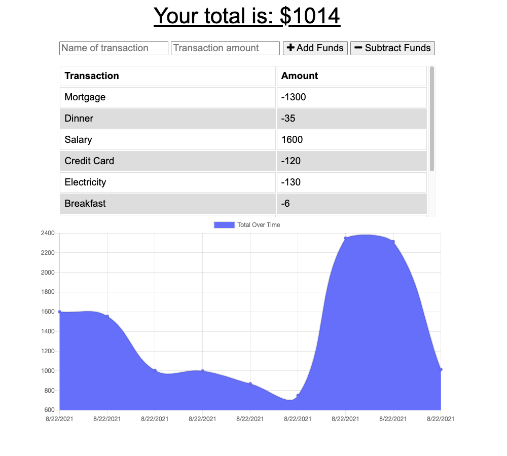

# budget-offline
## Description

Budget Tracker is an App that allows the user to track financial transactions.  I created this app to learn about using indexedDB to store transactions locally while the app did not have internet access.  The app watches for internet access to be restored and moves the local transactions to the online database and clears the local database.  

[Budget Tracker](https://budget-tracker-bdstpierre.herokuapp.com/)

## Table of Contents
- [Installation](#installation)
- [Usage](#usage)
- [Credits](#credits)
- [Questions](#questions)
- [License](#license)

## Installation
To create your instance of this project you can fork the repository and then create a Heroku app and a Mongo Atlas database.  Then you connect the app to the database and push the code to Heroku.
## Usage
To use the app you start up the app on Heroku and then navigate to the webpage.  You can enter transaction names and values and click on the "Add Funds" or "Subtract Funds" buttons as appropriate.  The app will display a list of transactions and a plot of the running total.
## Credits
This app makes use of Express, Mongoose (for interacting with the MongoDB database), MongoDB (and their online server, Atlas), and indexedDB for local storage of transactions while the internet is not available.
## Questions
If you have any questions you can contact the author through his github user profile: https://github.com/bdstpierre
or by sending an email to barry@stpierre.com
## License
Copyright 2021 Barry St. Pierre

    Permission is hereby granted, free of charge, to any person obtaining a copy of this software and associated documentation files (the "Software"), to deal in the Software without restriction, including without limitation the rights to use, copy, modify, merge, publish, distribute, sublicense, and/or sell copies of the Software, and to permit persons to whom the Software is furnished to do so, subject to the following conditions:
    
    The above copyright notice and this permission notice shall be included in all copies or substantial portions of the Software.
    
    THE SOFTWARE IS PROVIDED "AS IS", WITHOUT WARRANTY OF ANY KIND, EXPRESS OR IMPLIED, INCLUDING BUT NOT LIMITED TO THE WARRANTIES OF MERCHANTABILITY, FITNESS FOR A PARTICULAR PURPOSE AND NONINFRINGEMENT. IN NO EVENT SHALL THE AUTHORS OR COPYRIGHT HOLDERS BE LIABLE FOR ANY CLAIM, DAMAGES OR OTHER LIABILITY, WHETHER IN AN ACTION OF CONTRACT, TORT OR OTHERWISE, ARISING FROM, OUT OF OR IN CONNECTION WITH THE SOFTWARE OR THE USE OR OTHER DEALINGS IN THE SOFTWARE.
    
    

